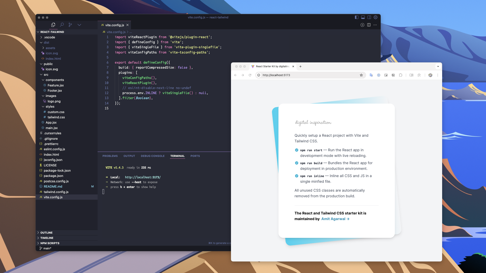

# 🚀 React and Tailwind Starter Kit

Quickly set up a new `React.js` project with Tailwind CSS using the [starter kit](https://github.com/labnol/react-tailwind). The project was bootstrapped with Vite (replacing Create React App) and it uses the `singlefile` plugin to inline all the JavaScript and CSS files into a single minified file.

The latest version of the starter kit is built with React 19 and Tailwind CSS 4.

### Available `npm` commands

In the project directory, you can run:

#### `npm run start`

Runs the app in the development mode.

Open `http://localhost:5173` to view it in the browser. The page will reload if you make edits. You will also see any lint errors in the console.

#### `npm run build`

Builds the React app for production to the `build` folder. It correctly bundles React in production mode and optimizes the build for the best performance.

#### `npm run inline`

This command will inline all the JavaScript and CSS files from the production build into a single minified file.
